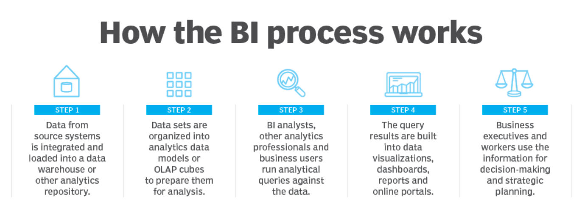

# What is business intelligence (BI)?
Business intelligence, or BI, is a **technology-driven data analysis process** that helps an organization's executives, managers and workers make **informed business decisions**. As part of the BI process, **relevant data is collected and prepared for analysis**. **Queries are run against the data, and the analytics results** are used to support** operational decision-making and strategic planning**.

The ultimate goal of BI initiatives is to drive better business decisions that enable organizations to **increase revenue, improve operational efficiency and gain competitive advantages over business rivals**. To achieve that goal, BI incorporates a combination of **analytics, data visualization and reporting tools**, plus various methodologies for managing and analyzing data.

BI software emerged in the early 1990s and is widely used in organizations of all sizes. In many cases, though, how it's used has changed over the years. The development first of self-service BI tools, and more recently of augmented analytics features based on artificial intelligence (AI) and machine learning technologies, has enabled business users to analyze data themselves instead of relying on BI professionals to run queries for them.

# How does the business intelligence process work?
Business intelligence initiatives uncover actionable information for use by senior executives, business managers and operational workers in various use cases. For example, BI applications generate insights on business performance, processes and trends, enabling management teams to identify problems and new opportunities and then take action to address them.

Business intelligence data is typically stored in a data warehouse built for an entire organization or in smaller data marts that hold subsets of business information for individual departments and business units. In addition, data lakes based on big data systems are often now used as repositories or landing pads for BI data, especially unstructured and semistructured data types. Data lakehouse platforms that combine elements of data lakes and data warehouses have also become available.

BI data can include both historical and real-time data gathered from a combination of internal IT systems and external sources. Before it's used in BI applications, raw data from different source systems usually must be integrated, consolidated and cleansed to ensure it's accurate and consistent.

From there, the steps in the BI process include the following:

Data preparation, in which data sets are organized, transformed and modeled for analysis.

Analytical querying of the prepared data.

Development of data visualizations, reports and dashboards with information on key performance indicators (KPIs) and other findings

Distribution of the analytics results to decision-makers, either by the BI team or self-service BI users sharing the information with business colleagues.

Use of the performance metrics and generated insights to help inform business decisions.

BI programs sometimes also incorporate forms of advanced analytics, such as data mining, predictive analytics, text mining and statistical analysis. Predictive modeling that enables what-if analysis of different business scenarios is one example. Most commonly, though, advanced analytics projects are handled by separate data science teams, while BI teams oversee more straightforward querying and analysis of business data.

# BI Process Works

