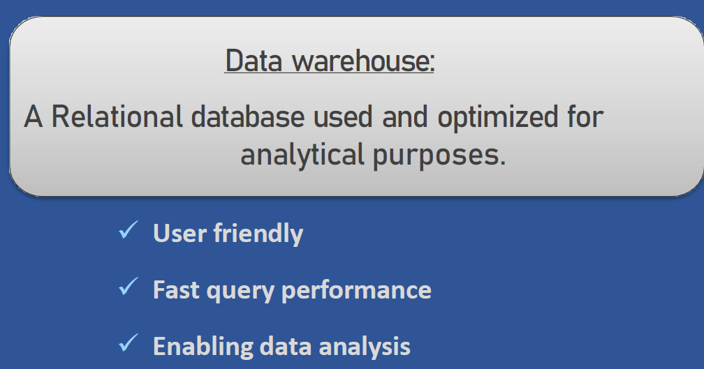
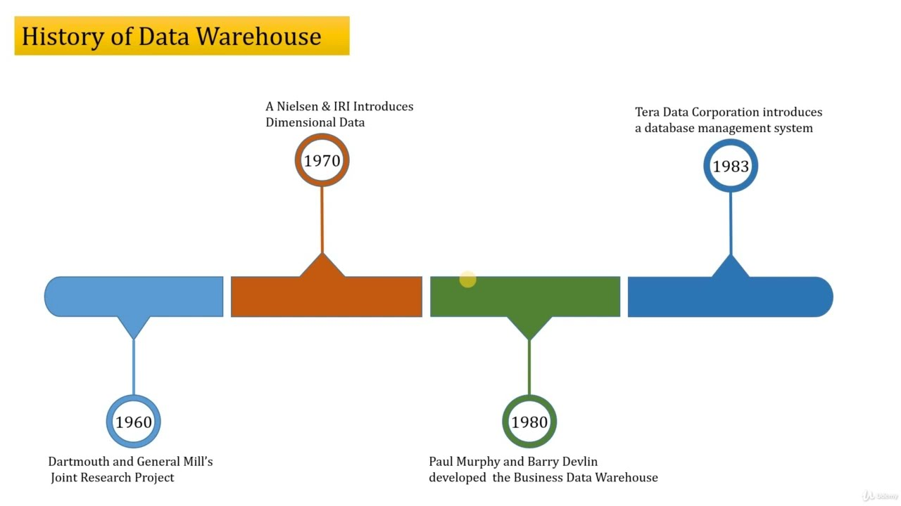
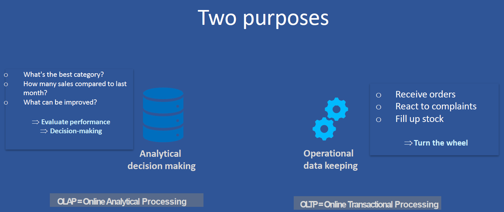
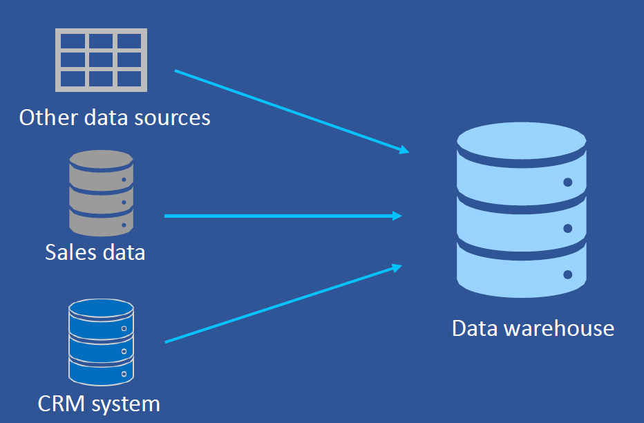
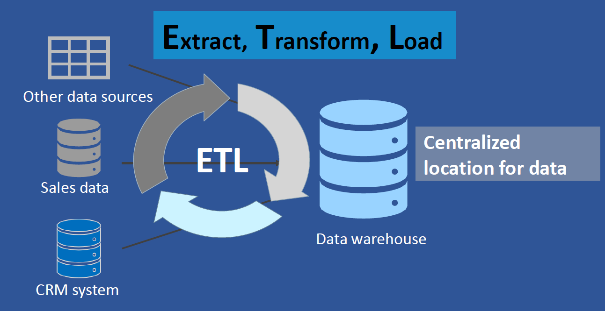
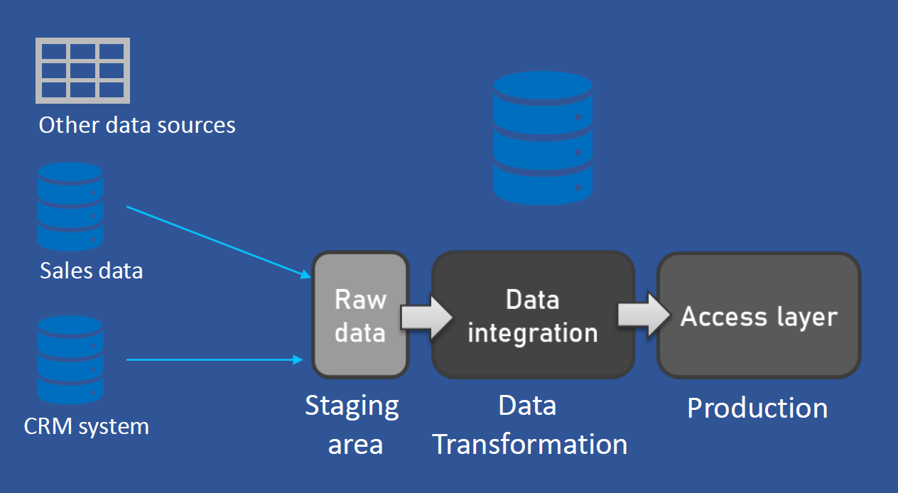
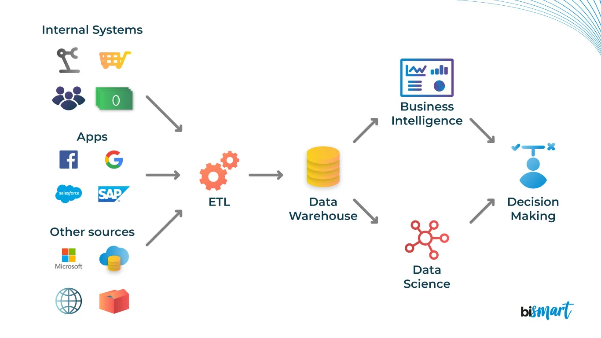

A Data Warehousing (DW) is process for **collecting and managing data from varied sources to** provide meaningful business insights. A Data warehouse is typically used to connect and analyze business data from heterogeneous sources. The data warehouse is the **core of the BI system** which is built for data analysis and reporting.

It is a blend of technologies and components which aids the **strategic use of data**. It is electronic storage of a large amount of information by a business which is designed for query and analysis instead of transaction processing. It is a process of **transforming data into information and making it available to users in a timely manner** to make a difference.

A **Data Warehouse (DW)** is a centralized repository that stores large volumes of structured and integrated data from various sources. This data is used for **reporting, analytics, and decision-making**.

- Supports **OLAP (Online Analytical Processing)**.
- Stores **historical data** for time-series analysis.
- Built using **ETL (Extract, Transform, Load)** processes.
  

---

## History of Data 

# 🏛️ History of Data Warehouse

This timeline outlines the major milestones in the development of data warehousing, highlighting the key contributors and their purpose.

---

## 📍 1960 – Dartmouth and General Mill’s Joint Research Project
- **Organizations Involved**: Dartmouth College & General Mills  
- **Purpose**: 
  - Conducted one of the first collaborative research projects exploring the use of computers in business decision-making.  
- **Significance**:  
  - Laid the foundation for **Decision Support Systems (DSS)**.  
  - Considered a precursor to modern-day data warehouse concepts.

---

## 📍 1970 – A.C. Nielsen & IRI Introduce Dimensional Data
- **Organizations**: A.C. Nielsen and Information Resources Inc. (IRI)  
- **Purpose**: 
  - Introduced the concept of **dimensional data modeling**, organizing data into **facts and dimensions**.  
- **Significance**:  
  - Birth of **OLAP (Online Analytical Processing)** structures.  
  - Pioneered the **star schema** model widely used in modern data warehouses.

---

## 📍 1980 – Paul Murphy and Barry Devlin Develop the Business Data Warehouse
- **People Involved**: Paul Murphy and Barry Devlin (IBM)  
- **Purpose**: 
  - Proposed a structured **architecture** for organizing enterprise data to support decision-making.  
- **Significance**:  
  - First formal definition of a **Data Warehouse**.  
  - Distinguished **operational systems (OLTP)** from **informational systems (OLAP)**.

---

## 📍 1983 – Teradata Corporation Introduces a DBMS for Warehousing
- **Organization**: Teradata Corporation  
- **Purpose**: 
  - Released a **Database Management System** optimized for analytical workloads and massive datasets.  
- **Significance**:  
  - One of the first commercial DBMS built for **data warehousing**.  
  - Enabled efficient processing of **large-scale analytical queries**.

---

## 🧾 Summary Table

| Year | Contributor(s)                 | Contribution                                          | Importance                                      |
|------|--------------------------------|-------------------------------------------------------|--------------------------------------------------|
| 1960 | Dartmouth & General Mills      | Decision Support Systems Research                     | Foundation of DSS & analytical systems           |
| 1970 | A.C. Nielsen & IRI             | Dimensional Data Modeling                             | Basis for OLAP and star schema                   |
| 1980 | Paul Murphy & Barry Devlin     | Business Data Warehouse Concept                       | Separation of operational and analytical systems |
| 1983 | Teradata Corporation           | Data Warehouse-Specific DBMS                          | Enabled large-scale analytical processing        |

---

| Period     | Evolution & Milestones |
|------------|-------------------------|
| 1970s      | IBM researchers explored decision support systems. |
| 1983       | John Zachman published a framework for information systems architecture. |
| 1988       | Barry Devlin and Paul Murphy coined the term "Business Data Warehouse". |
| 1990s      | Data Warehousing became mainstream via Bill Inmon and Ralph Kimball. |
| 2000s      | Growth of OLAP, metadata repositories, and ETL tools. |
| 2010s–Now  | Rise of cloud-based DWs like Snowflake, BigQuery, Redshift, Azure Synapse. |

---
# 📊 Two Key Purposes of Data Processing

Data systems typically serve **two distinct purposes** in an organization:

---

## 1. 🧠 Analytical Decision Making  
**OLAP – Online Analytical Processing**

### 🔍 Purpose:
To analyze historical data, generate insights, and assist in strategic decision-making.

### 💡 Key Questions Addressed:
- What’s the best-performing category?
- How do this month’s sales compare to last month?
- What areas can be improved?

### ✅ Outcomes:
- **Evaluate performance**
- **Strategic planning and business intelligence**
- **Trend analysis**

### ⚙️ Characteristics:
- Read-heavy workloads
- Data is collected from various sources
- Structured in multidimensional schemas (e.g., star, snowflake)
- Time-variant, subject-oriented, and non-volatile

### 🏢 Real-World Use Cases:
| Industry   | Use Case Example                                                                 |
|------------|----------------------------------------------------------------------------------|
| Retail     | Analyze product sales by region and season to optimize inventory and marketing. |
| Healthcare | Track patient outcomes over time to evaluate treatment effectiveness.           |
| Finance    | Forecast revenue trends or investment risks.                                    |
| Marketing  | Segment customers based on behavior for targeted campaigns.                     |

---

## 2. ⚙️ Operational Data Keeping  
**OLTP – Online Transactional Processing**

### 🔍 Purpose:
To manage day-to-day transactional operations in real-time.

### 💡 Key Activities:
- Receive customer orders
- Handle complaints or support tickets
- Manage inventory and stock levels

### ✅ Outcomes:
- **Keeps the business running ("Turn the wheel")**
- **Supports real-time data entry, updates, and retrieval**

### ⚙️ Characteristics:
- Write-heavy workloads (insert, update, delete operations)
- Highly normalized databases
- Handles concurrent access by many users

### 🏢 Real-World Use Cases:
| Industry   | Use Case Example                                                                   |
|------------|------------------------------------------------------------------------------------|
| E-commerce | Customers placing orders, adding to cart, and updating shipping addresses.         |
| Banking    | Processing transactions like deposits, withdrawals, and balance inquiries.         |
| Healthcare | Booking appointments and updating patient records in real-time.                    |
| Logistics  | Updating delivery status and tracking in real-time.                                |

---

## 🔄 OLTP vs OLAP – Summary Table

| Feature           | OLTP (Operational)                          | OLAP (Analytical)                           |
|-------------------|---------------------------------------------|---------------------------------------------|
| Purpose           | Day-to-day operations                       | Decision support & analysis                 |
| Query Type        | Simple, fast queries                        | Complex, multi-table joins                  |
| Data Modification | Frequent (Insert/Update/Delete)            | Rare (mainly Read)                          |
| Database Design   | Highly normalized                          | De-normalized (star/snowflake schema)       |
| Example System    | ERP, CRM, POS                              | Data Warehouse, BI Tools                    |

---

## How Datawarehouse works?
A Data Warehouse works as a central repository where information arrives from one or more data sources. Data flows into a data warehouse from the transactional system and other relational databases.

Data may be:

**Structured**

**Semi-structured**

**Unstructured data**

The data is processed, transformed, and ingested so that users can access the processed data in the Data Warehouse through Business Intelligence tools, SQL clients, and spreadsheets. A data warehouse merges information coming from different sources into one comprehensive database.

By merging all of this information in one place, an organization can analyze its customers more holistically. This helps to ensure that it has considered all the information available. Data warehousing makes data mining possible. Data mining is looking for patterns in the data that may lead to higher sales and profits.

## Types of Data Warehouse
Three main types of Data Warehouses (DWH) are:

## 1. Enterprise Data Warehouse (EDW):

Enterprise Data Warehouse (EDW) is a centralized warehouse. It provides decision support service across the enterprise. It offers a unified approach for organizing and representing data. It also provide the ability to classify data according to the subject and give access according to those divisions.
### Architecture Overview
[ Source Systems ] → [ ETL ] → [ EDW ] → [ BI Tools / Reports ]

## 2. Operational Data Store:

Operational Data Store, which is also called ODS, are nothing but data store required when neither Data warehouse nor OLTP systems support organizations reporting needs. In ODS, Data warehouse is refreshed in real time. Hence, it is widely preferred for routine activities like storing records of the Employees.

3. Data Mart:

A data mart is a subset of the data warehouse. It specially designed for a particular line of business, such as sales, finance, sales or finance. In an independent data mart, data can collect directly from sources.

## Why Do We Need a Data Warehouse?

### Key Reasons
1. **Data Integration**: Combines data from diverse sources.
2. **Historical Analysis**: Enables long-term trend studies.
3. **Decision Support**: Helps leadership make informed choices.
4. **Improved Query Performance**: Optimized for fast analytics.
5. **Data Consistency**: Cleaned and structured data.
6. **Governance**: Centralized control for audits and compliance.

---

## Architecture of Data Warehouse

### Typical Layers
1. **Data Sources**: CRM, ERP, APIs, Flat Files
2. **ETL Layer**: Extract, Transform, Load using tools
3. **Data Warehouse**: Central storage (e.g., Snowflake)
4. **Data Marts**: Subject-area subsets
5. **BI Tools**: Dashboards and analytics (e.g., Power BI)

---

## Real-World Applications
| Industry        | Company            | Use Case |
|-----------------|--------------------|----------|
| Retail          | Walmart            | Tracks POS data and supply chain analytics. |
| Healthcare      | UnitedHealth       | Integrates EHR and claims data for insights. |
| E-commerce      | Amazon             | Uses user behavior data for recommendations. |
| Finance         | JPMorgan Chase     | Credit scoring, fraud analysis. |
| Telecom         | Verizon            | Network optimization and customer analytics. |
| Education       | Coursera           | Tracks student performance and engagement. |
| Entertainment   | Netflix            | Viewing behavior analytics for personalization. |
| Manufacturing   | Boeing             | Production and maintenance data analysis. |
| Logistics       | FedEx              | Shipment tracking and route optimization. |
| Pharmaceutical  | Pfizer             | Centralized clinical trials and reporting. |

---

## Common Technologies Used in Data Warehousing

| Category          | Examples |
|-------------------|----------|
| Cloud DW          | Snowflake, Redshift, BigQuery, Azure Synapse |
| ETL Tools         | Informatica, Talend, NiFi, Azure Data Factory |
| BI Tools          | Power BI, Tableau, Looker, QlikView |
| OLAP Engines      | Microsoft SSAS, IBM Cognos, Apache Kylin |
| Data Modeling     | Star Schema, Snowflake Schema |

---

## Use Cases by Role

| Role        | DW Application |
|-------------|----------------|
| CEO         | Company-wide KPIs and dashboards |
| CFO         | Financial forecasting and trend analysis |
| HR Manager  | Workforce trends and attrition tracking |
| Marketing   | Campaign ROI and lead conversion tracking |
| Sales       | Regional/product-based performance |
| Analyst     | Data mining, predictive modeling |

---

## Conclusion

A **Data Warehouse** is the foundation of modern analytics and BI systems. It allows organizations to unify, standardize, and analyze data to gain actionable insights. With the evolution of **cloud-based platforms**, DWs are more scalable, affordable, and vital than ever before.
