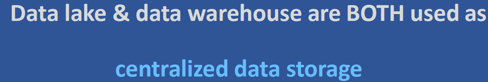

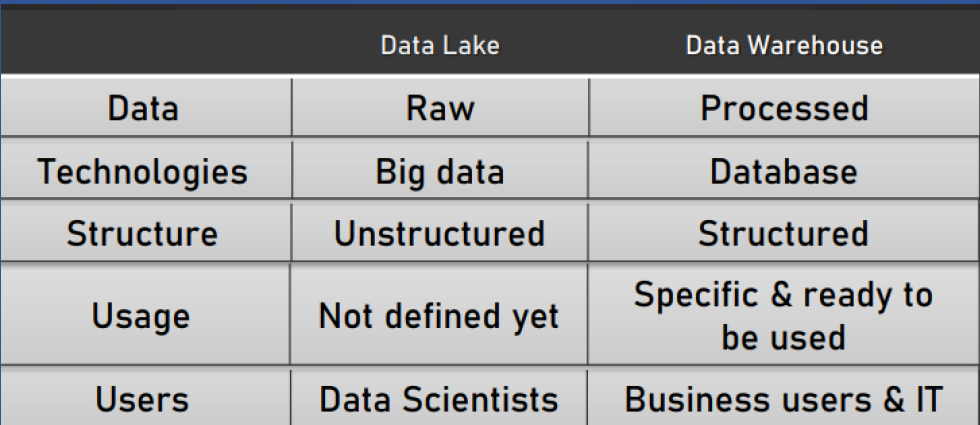

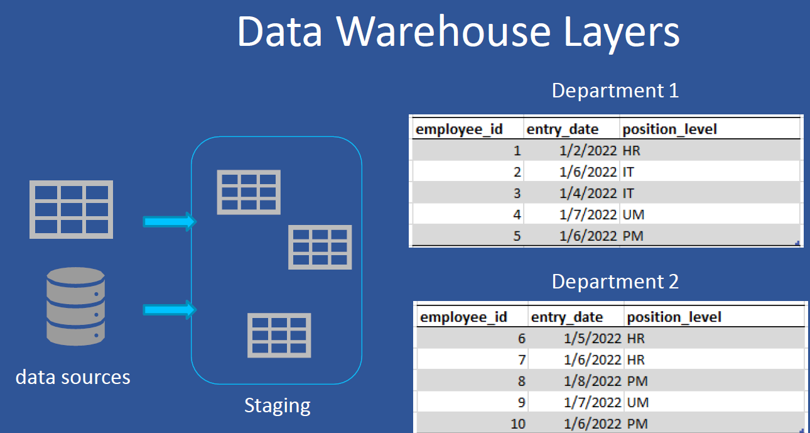

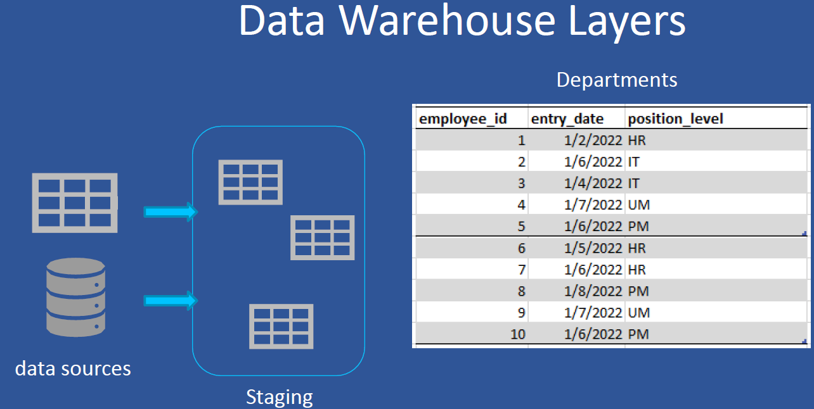

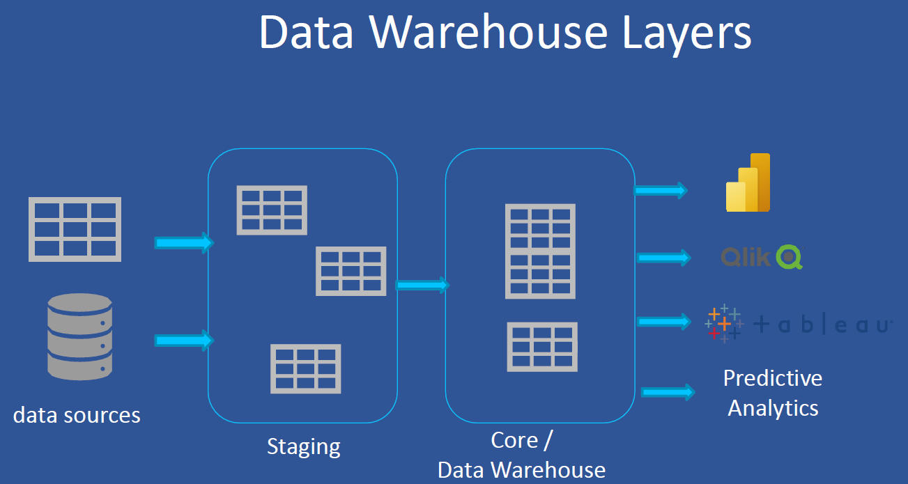

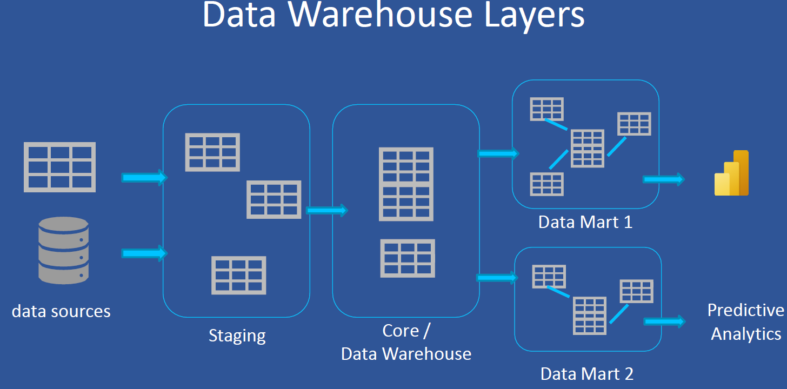

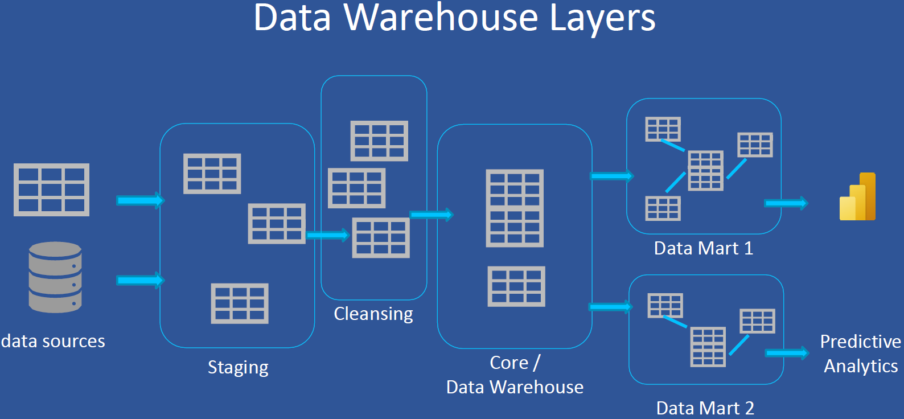

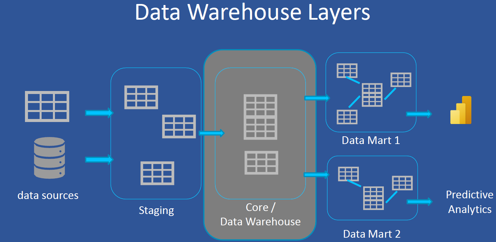

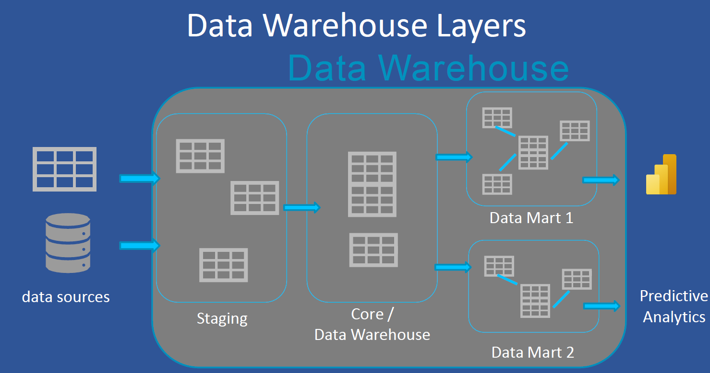

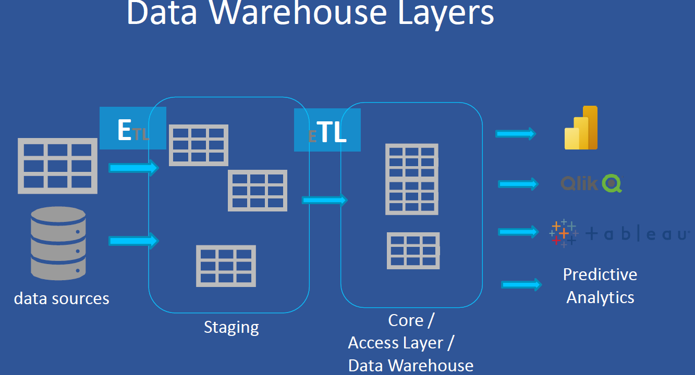

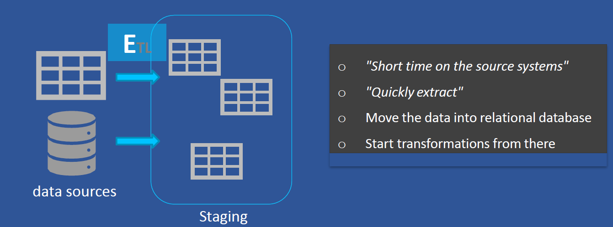

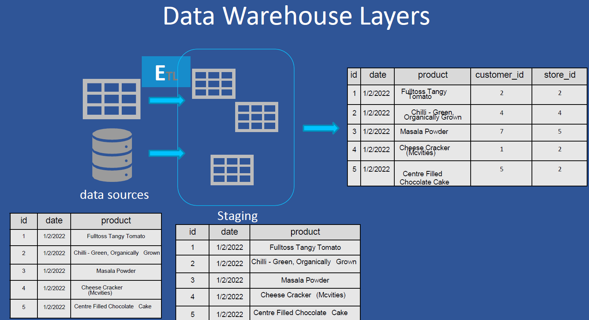

This diagram illustrates a **multi-layer architecture** of a Data Warehouse, showing how raw data flows from various sources through the **ETL process**, **staging area**, and into the **final data warehouse**.

---

## 🔄 1. Data Sources
- **Definition**: Operational systems where raw data originates.
- **Examples**: Transactional databases, CSV files, ERP, CRM, external APIs.
- **Shown in Image**: A table with columns: `id`, `date`, and `product`.

---

## ⚙️ 2. ETL Process (Extract, Transform, Load)
- **Extract**: Pull data from source systems.
- **Transform**: Clean, standardize, and restructure data (e.g., remove extra spaces, fix data types).
- **Load**: Push data into the staging area for validation.

---

## 📥 3. Staging Area
- **Definition**: A temporary area to hold extracted data before final processing.
- **Purpose**:
  - Pre-validates data before moving to the warehouse.
  - Reduces load on source systems.
- **In the Image**: Shows product data cleaned and aligned (extra spaces removed, consistent formatting).

---

## 🧮 4. Data Warehouse Layer
- **Definition**: The central repository for integrated, processed data used for analytics.
- **Final Table Example**:
  - Columns: `id`, `date`, `product`, `customer_id`, `store_id`
- **Purpose**:
  - Optimized for **reporting, dashboards, analytics, and BI tools**.
  - Joined with other tables to enrich the dataset.

---
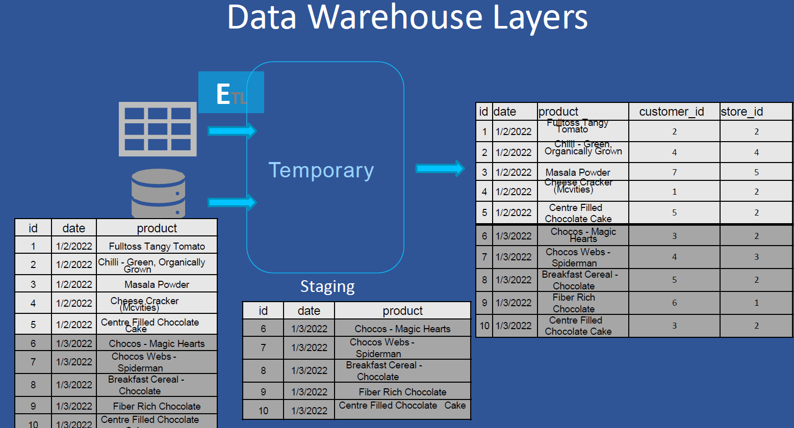

The diagram represents the **Data Warehouse Layers** using an ETL (Extract, Transform, Load) process with sample data tables.

---

## 1. Source Data (Raw Data)

This is the initial raw data collected from transactional or operational systems.

| id | date     | product                                |
|----|----------|-----------------------------------------|
| 1  | 1/2/2022 | Fulltoss Tangy Tomato                   |
| 2  | 1/2/2022 | Chilli - Green, Organically Grown       |
| 3  | 1/2/2022 | Masala Powder                           |
| 4  | 1/2/2022 | Cheese Cracker (McVities)               |
| 5  | 1/2/2022 | Centre Filled Chocolate Cake            |
| 6  | 1/3/2022 | Chocos - Magic Hearts                   |
| 7  | 1/3/2022 | Chocos Webs - Spiderman                 |
| 8  | 1/3/2022 | Breakfast Cereal - Chocolate            |
| 9  | 1/3/2022 | Fiber Rich Chocolate                    |
| 10 | 1/3/2022 | Centre Filled Chocolate Cake            |

- Represents unprocessed data directly from external systems.
- Only basic product info is available here.

---

## 2. ETL Process

The ETL (Extract, Transform, Load) process involves:
- **Extract**: Pull data from source systems.
- **Transform**: Clean, standardize, enrich, validate data.
- **Load**: Insert transformed data into staging and final warehouse layers.

---

## 3. Temporary Layer

This is a **buffer zone** that holds data immediately after extraction.

- Used for initial data validation and backup before transformation.
- Temporary tables are often cleared after successful ETL.

---

## 4. Staging Layer

The staging area stores partially cleaned data before it is fully enriched.

| id | date     | product                                |
|----|----------|-----------------------------------------|
| 6  | 1/3/2022 | Chocos - Magic Hearts                   |
| 7  | 1/3/2022 | Chocos Webs - Spiderman                 |
| 8  | 1/3/2022 | Breakfast Cereal - Chocolate            |
| 9  | 1/3/2022 | Fiber Rich Chocolate                    |
| 10 | 1/3/2022 | Centre Filled Chocolate Cake            |

- Acts as an intermediate storage.
- Helps in auditing, testing, and ensuring data quality.

---

## 5. Data Warehouse Layer (Final Table)

This is the cleaned, transformed, and enriched data ready for analytics.

| id | date     | product                                | customer_id | store_id |
|----|----------|-----------------------------------------|-------------|----------|
| 1  | 1/2/2022 | Fulltoss Tangy Tomato                   | 2           | 2        |
| 2  | 1/2/2022 | Chilli - Green, Organically Grown       | 4           | 4        |
| 3  | 1/2/2022 | Masala Powder                           | 7           | 5        |
| 4  | 1/2/2022 | Cheese Cracker (McVities)               | 1           | 2        |
| 5  | 1/2/2022 | Centre Filled Chocolate Cake            | 5           | 2        |
| 6  | 1/3/2022 | Chocos - Magic Hearts                   | 3           | 2        |
| 7  | 1/3/2022 | Chocos Webs - Spiderman                 | 4           | 3        |
| 8  | 1/3/2022 | Breakfast Cereal - Chocolate            | 2           | 4        |
| 9  | 1/3/2022 | Fiber Rich Chocolate                    | 6           | 1        |
| 10 | 1/3/2022 | Centre Filled Chocolate Cake            | 3           | 2        |

- Includes business attributes like `customer_id` and `store_id`.
- Ready for reporting, dashboarding, and analytics.

---

## Summary of Layers

| Layer         | Purpose                                             |
|---------------|-----------------------------------------------------|
| Source        | Collect raw transactional data                     |
| Temporary     | Buffer for initial raw load                        |
| Staging       | Cleaned but not yet joined or transformed fully    |
| Warehouse     | Final structured, enriched data for analytics      |

---

## Real-World Applications

This architecture is used by organizations such as:
- **Retail Chains**: Walmart, Target
- **E-Commerce**: Amazon, Flipkart
- **FMCG Companies**: Nestle, Britannia

Used for:
- Sales reporting
- Customer behavior analysis
- Demand forecasting
- Product performance tracking

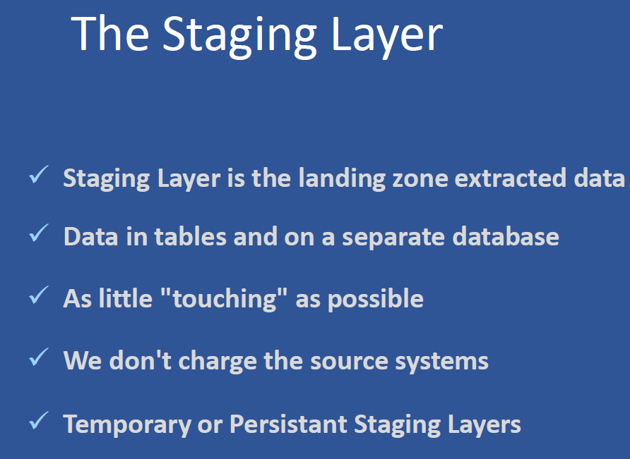

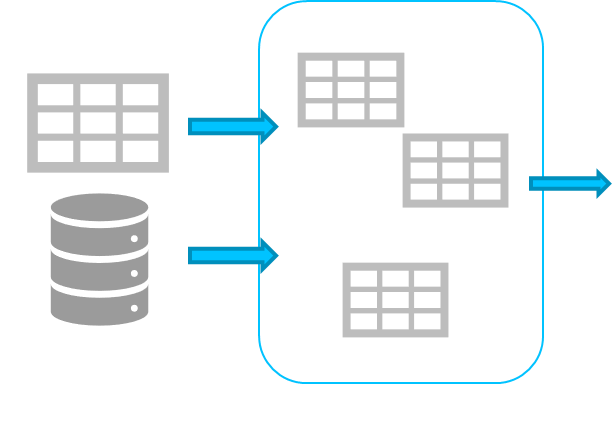

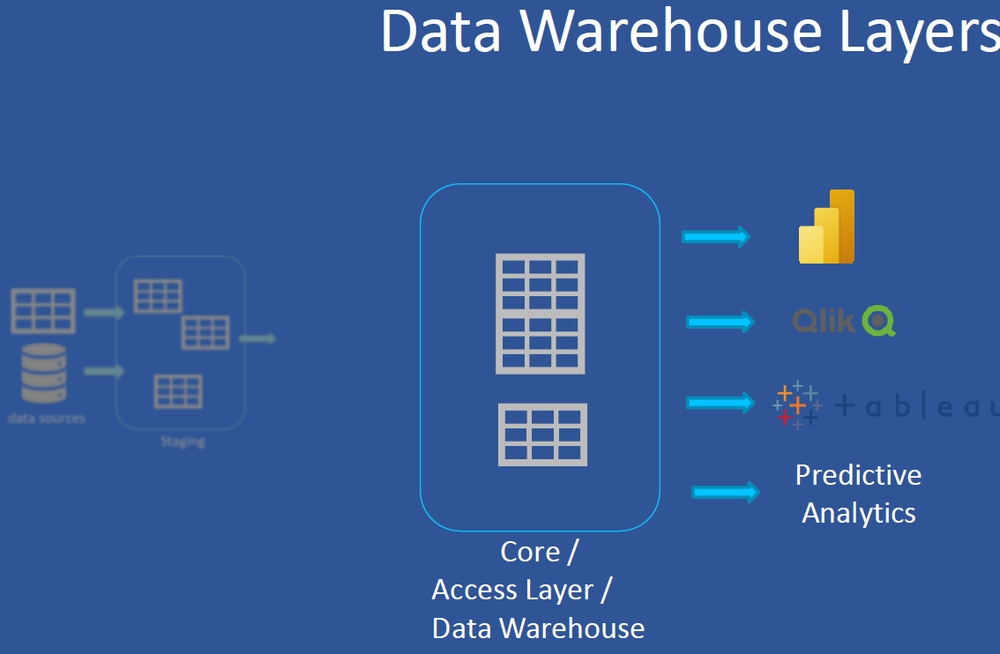

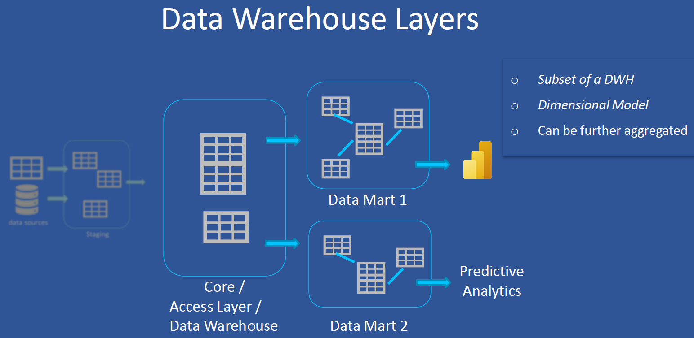

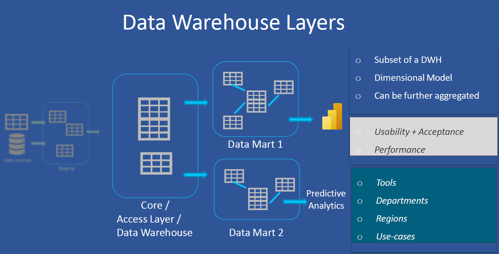

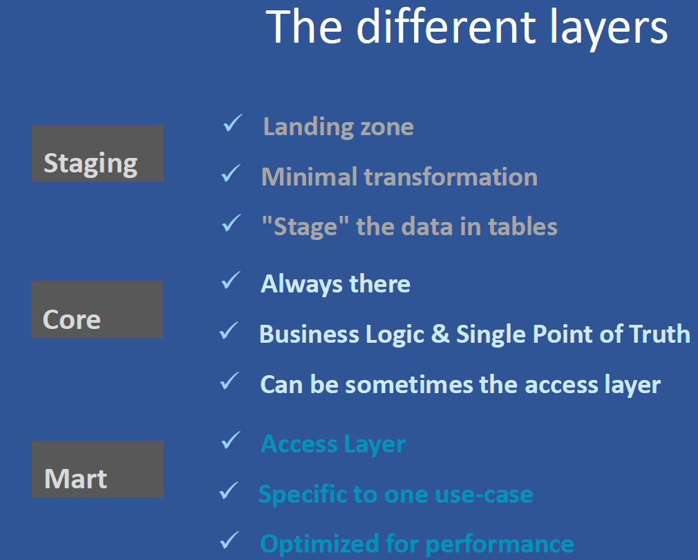

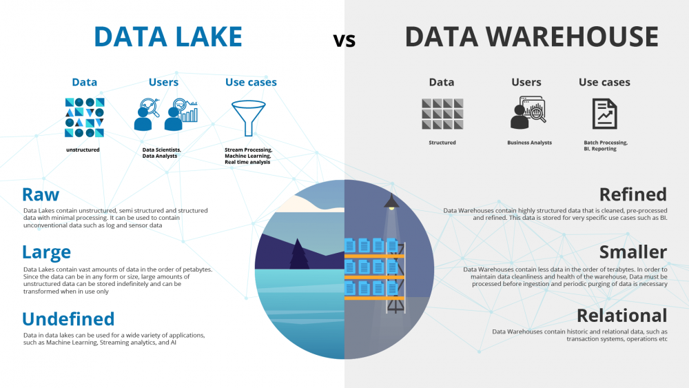

# 🏗️ Difference Between Data Lake and Data Warehouse

| Feature                     | **Data Lake**                                                | **Data Warehouse**                                             |
|----------------------------|--------------------------------------------------------------|----------------------------------------------------------------|
| **Definition**             | A centralized repository for storing **raw, unprocessed data** of all types. | A structured repository optimized for **processed and structured data** used for reporting and analytics. |
| **Data Type**              | Structured, semi-structured, and unstructured data (logs, images, audio, video, etc.) | Structured data (tables with rows and columns)                 |
| **Data Format**            | Can store data in its native format (JSON, XML, CSV, Parquet, etc.) | Requires structured data (transformed and cleaned)             |
| **Schema**                 | **Schema-on-read** – structure is applied at analysis time   | **Schema-on-write** – structure is applied when data is written |
| **Purpose**                | Ideal for **big data**, data science, and machine learning   | Ideal for **business intelligence** and reporting              |
| **Users**                  | Data engineers, data scientists, analysts                    | Business analysts, executives, decision-makers                |
| **Performance**            | Slower for complex queries due to lack of indexing or structure | Optimized for fast querying using indexes, materialized views  |
| **Storage Cost**           | Lower (cheap object storage like Azure Data Lake Gen2, S3)   | Higher (premium managed SQL services)                         |
| **Processing**             | ELT (Extract, Load, Transform)                              | ETL (Extract, Transform, Load)                                |
| **Examples**               | Azure Data Lake, Amazon S3, Hadoop HDFS                      | Azure Synapse, Amazon Redshift, Snowflake, Google BigQuery    |
| **Governance & Security** | More complex to manage due to raw data diversity             | Easier with mature governance features                        |

---

## 🧪 Use Case Comparison

| Use Case Scenario                                  | Best Fit             |
|----------------------------------------------------|----------------------|
| Store raw log files, IoT streams, images           | ✅ Data Lake         |
| Generate dashboards, reports for KPIs              | ✅ Data Warehouse    |
| Training ML models on large unstructured datasets  | ✅ Data Lake         |
| Running predefined business queries and reports    | ✅ Data Warehouse    |
| Historical data archiving from various systems     | ✅ Data Lake         |
| Creating a data mart for Sales and Finance         | ✅ Data Warehouse    |

---

## 🔄 Data Lake + Data Warehouse = Data Lakehouse?

Some modern platforms (like **Databricks Lakehouse**, **Snowflake**, **Microsoft Fabric**) aim to combine the flexibility of a **Data Lake** with the performance of a **Data Warehouse**, known as the **Lakehouse Architecture**.
