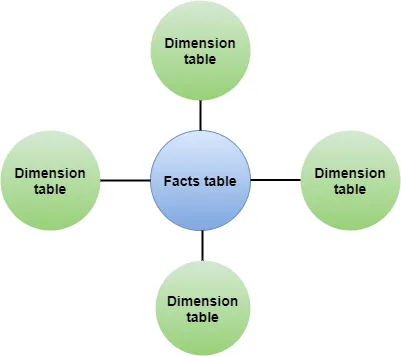
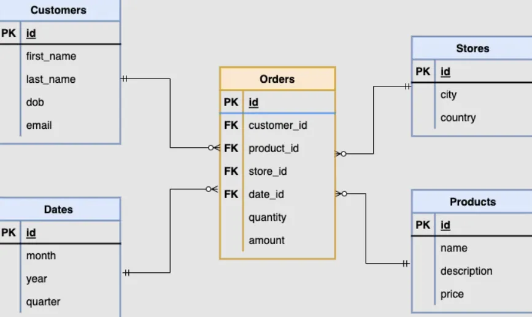
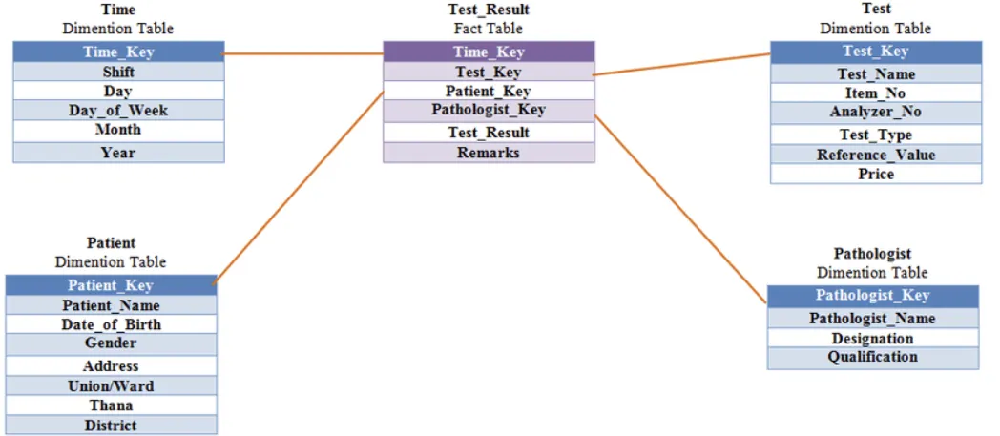
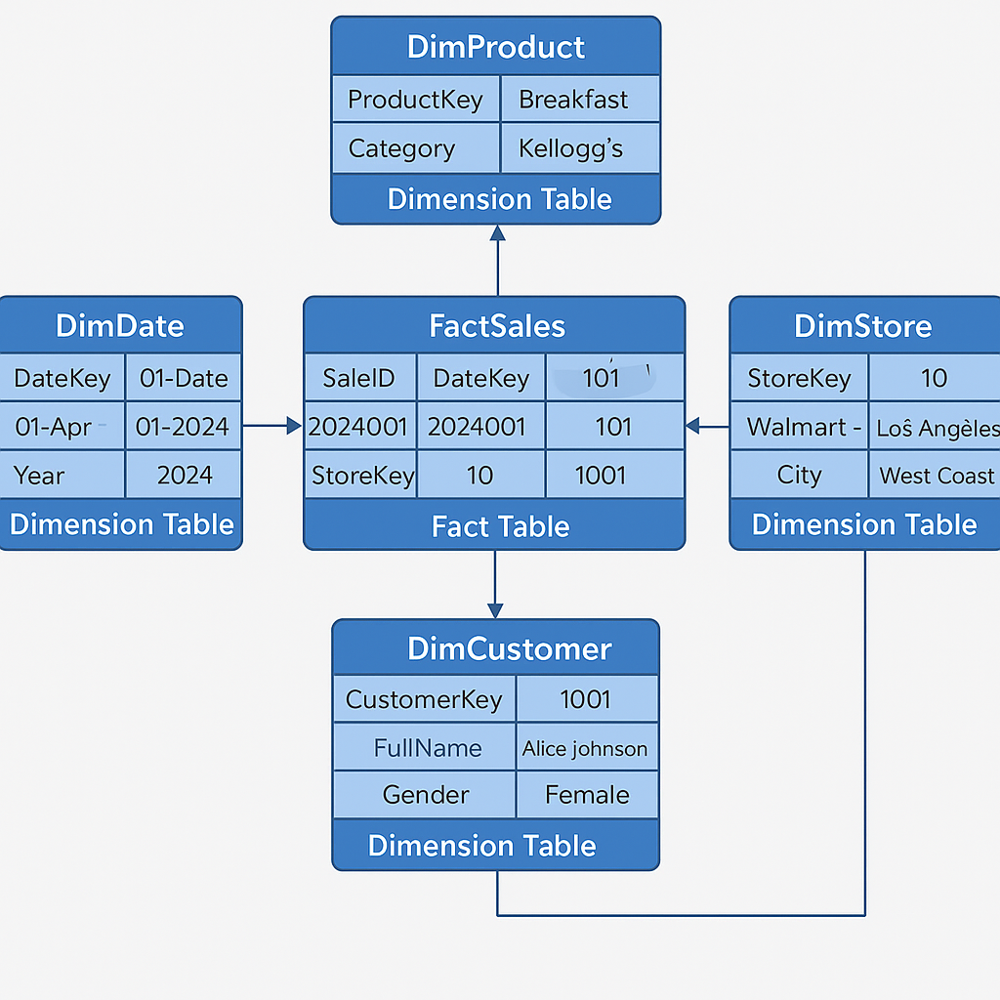

## What is Dimensional Modeling?

Dimensional Modeling is a data design technique used in **data warehouses** to organize data into **fact** and **dimension** tables. It is optimized for **OLAP** (Online Analytical Processing) and helps in fast and intuitive querying and reporting.

Popularized by **Ralph Kimball**, it simplifies complex business data.

---

## 🧱 Key Concepts

| Component         | Description |
|------------------|-------------|
| **Fact Table**    | Contains measurable business data (e.g., sales amount, quantity). Includes foreign keys referencing dimension tables. |
| **Dimension Table** | Contains descriptive attributes used for filtering and grouping (e.g., product name, customer region). |
| **Grain**         | The level of detail represented in a fact table (e.g., per transaction, per day). |
| **Star Schema**   | A central fact table directly connected to dimension tables. |
| **Snowflake Schema** | Normalized dimension tables that may contain sub-dimensions. Reduces redundancy but increases complexity. |

---
# What is a Fact Table?

A fact table stores **quantitative information** for analysis and is often denormalized. A fact table works with dimension tables, and it holds the data to be analyzed and a dimension table stores data about the ways in which the data can be analyzed.

A fact table or a fact entity is a table or entity in a star or snowflake schema that stores measures that measure the business, such as **sales, cost of goods, or profit**.

The fact table is a central table in the data schemas.

A fact table consists of **two types of columns**. The **foreign keys** column allows to join with dimension tables and the **measure columns** contain the data that is being analyzed.

## 🏪 Real-World Example: Retail Store Sales

### ✅ Business Scenario

Analyze **sales data** across different **stores**, **dates**, and **products** for a retail chain (e.g., Walmart).

---

### 💾 Tables

#### 🔹 Fact Table: `FactSales`

| SaleID | DateKey  | ProductKey | StoreKey | CustomerKey | Quantity | TotalAmount |
|--------|----------|------------|----------|-------------|----------|-------------|
| 1      | 20240401 | 101        | 10       | 1001        | 2        | 500.00      |

- **Measures**: Quantity, TotalAmount  
- **Foreign Keys**: DateKey, ProductKey, StoreKey, CustomerKey

---

#### 🔹 Dimension Tables

**1. DimProduct**

| ProductKey | ProductName       | Category   | Brand     |
|------------|-------------------|------------|-----------|
| 101        | Chocos            | Breakfast  | Kellogg’s |

**2. DimStore**

| StoreKey | StoreName     | City       | Region     |
|----------|---------------|------------|------------|
| 10       | Walmart - LA  | Los Angeles| West Coast |

**3. DimCustomer**

| CustomerKey | FullName       | Gender | AgeGroup |
|-------------|----------------|--------|----------|
| 1001        | Alice Johnson  | Female | 25-34    |

**4. DimDate**

| DateKey  | FullDate   | Month | Year |
|----------|------------|-------|------|
| 20240401 | 01-Apr-2024| April | 2024 |

---

