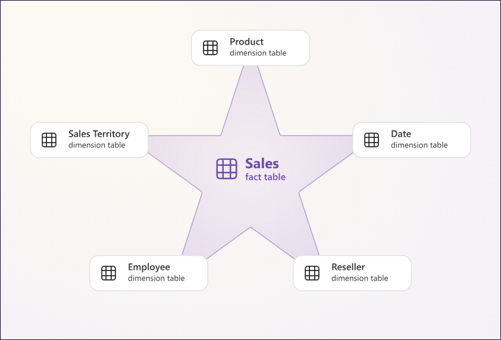
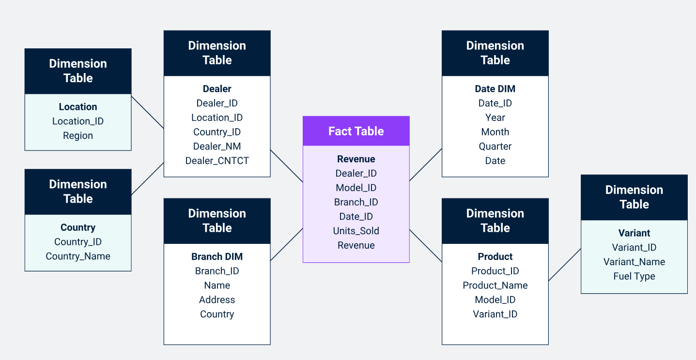
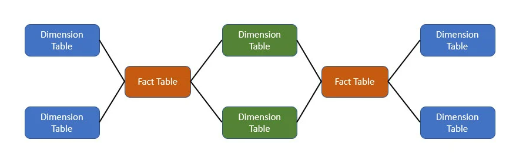

## ⭐ 1. Star Schema

### 🔹 Definition
A **Star Schema** is the simplest and most commonly used schema in a data warehouse. It has a central **Fact Table** connected to multiple **Dimension Tables**. The structure resembles a star.

### 🔹 Characteristics
- Denormalized dimension tables
- Simple to understand and query
- Faster for querying and reporting

### 🔹 Real-World Example: Retail Sales

#### Fact Table: `FactSales`

| SaleID | DateKey  | ProductKey | StoreKey | CustomerKey | Quantity | TotalAmount |
|--------|----------|------------|----------|-------------|----------|-------------|

#### Dimension Tables:
- `DimProduct` (ProductKey, Name, Category)
- `DimStore` (StoreKey, StoreName, Region)
- `DimDate` (DateKey, FullDate, Month, Year)
- `DimCustomer` (CustomerKey, Name, Gender, AgeGroup)

#### Use Cases:
- Analyze sales by region
- View monthly product trends
- Track customer revenue

---

## ❄️ 2. Snowflake Schema

What is a Snowflake Schema?
The Snowflake Schema is a data warehouse schema that encompasses a logical arrangement of dimension tables. This data warehouse schema builds on the star schema by adding additional sub-dimension tables that relate to first-order dimension tables joined to the fact table.

Just like the relationship between the foreign key in the fact table and the primary key in the dimension table, with the snowflake schema approach, a primary key in a sub-dimension table will relate to a foreign key within the higher order dimension table.

Snowflake schema creates normalized dimension tables—a database structuring strategy that organizes tables to reduce redundancy. The purpose of normalization is to eliminate any redundant data to reduce overhead.

## Characteristics of the Snowflake Schema:
 
Snowflake Schema are permitted to have dimension tables joined to other dimension tables
Snowflake Schema are to have one fact table only
Snowflake Schema create normalized dimension tables
The normalized schema reduces required disk space for running and managing this data warehouse
Snowflake Scheme offer an easier way to implement a dimension

### 🔹 Definition
A **Snowflake Schema** is a normalized version of the star schema. Dimension tables are split into sub-dimensions for better data structure and storage efficiency.

### 🔹 Characteristics
- Dimension tables are normalized
- Requires more joins
- Better data integrity and space optimization

### 🔹 Real-World Example: Retail Sales with Normalized Attributes

#### Normalized Dimension Structure:
- `DimProduct`
  - ProductKey, ProductName, CategoryKey, BrandKey
- `DimCategory`
  - CategoryKey, CategoryName
- `DimBrand`
  - BrandKey, BrandName

- `DimStore`
  - StoreKey, StoreName, CityKey
- `DimCity`
  - CityKey, CityName, RegionKey
- `DimRegion`
  - RegionKey, RegionName

#### Use Cases:
- Efficient storage for large dimension data
- Avoid data redundancy
- Maintain consistency across shared attributes

---

## 🌌 3. Fact Constellation Schema (Galaxy Schema)

Fact Constellation Schema is a schema that represents a multidimensional model of tables. This schema is a group of different fact tables that have few similar dimensional tables. It can be represented as a group of multiple star schemas and thus, it is also called a Galaxy schema. Fact schema is the most frequently used schema to design a Data warehouse and also, it is a little complicated than star and snowflake schema model.

Fact constellation schema is a tool of analytical processing via online, which has a huge group of the number of fact tables that share dimensional tables, also aggregated as a group of stars. We can also call it as an extension of the star constellation model.

A fact constellation schema can have multiple fact tables associated with it. It is commonly used a schema for designing data warehouses and it is much complicated than any other schema such as star and snowflake schema. We can create a fact constellation schema from a star schema by splitting them into one or more star schemas. It is also said that a fact constellation schema can have many fact tables and a shared dimensional table.
### 🔹 Definition
A **Fact Constellation Schema** (also called a Galaxy Schema) contains **multiple Fact Tables** that share common Dimension Tables. It supports complex data warehousing scenarios.

### 🔹 Characteristics
- Multiple fact tables
- Shared dimension tables
- Supports multiple business processes

### 🔹 Real-World Example: Retail Chain with Sales and Inventory

#### Fact Tables:
- `FactSales`: Tracks product sales transactions
- `FactInventory`: Tracks inventory levels daily

#### Shared Dimensions:
- `DimProduct`
- `DimStore`
- `DimDate`

#### Exclusive Dimensions:
- `DimCustomer` (for `FactSales`)
- `DimSupplier` (for `FactInventory`)

#### Use Cases:
- Compare sales with stock levels
- Supplier performance tracking
- Customer buying patterns

---

## 🧾 Summary Comparison

| Feature                | Star Schema            | Snowflake Schema             | Fact Constellation Schema     |
|------------------------|------------------------|------------------------------|-------------------------------|
| **Structure**          | Fact + denormalized dims | Fact + normalized dims        | Multiple facts + shared dims  |
| **Performance**        | Fast                    | Slightly slower              | Varies                        |
| **Complexity**         | Simple                  | Moderate                     | Complex                       |
| **Use Case**           | Simple BI reporting     | Space-efficient data models  | Enterprise-wide analytics     |
| **Example**            | Sales dashboard         | Normalized product hierarchy | Sales + Inventory + Payments  |

---

