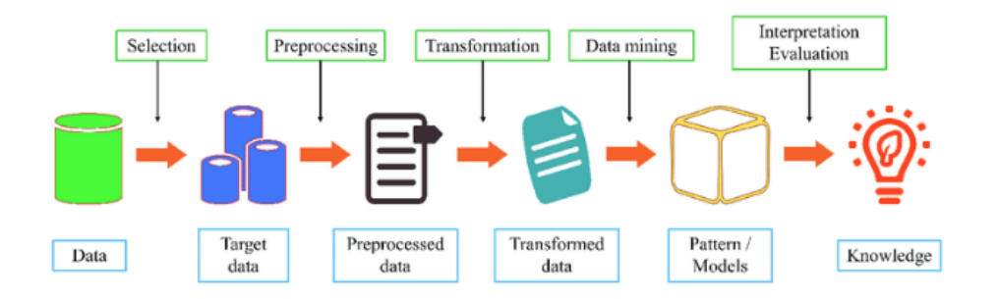

# 📊 What is Data Mining?

**Data Mining** is the process of discovering meaningful patterns, relationships, and insights from large sets of raw data using statistical, machine learning, and AI techniques.

> 🔍 It helps transform data into **useful information** for decision-making.
In this process, data is extracted and analyzed to fetch useful information. In data mining hidden patterns are researched from the dataset to predict future behavior. Data mining is used to indicate and discover relationships through the data.

Data mining uses statistics, artificial intelligence, machine learning systems, and some databases to find hidden patterns in the data. It supports business-related queries that are time-consuming to resolve.

## Features of Data Mining:
- It is good with large databases and datasets

- It predicts future results

- It creates actionable insights

- It utilizes the automated discovery of patterns
 ## Advantages of Data Mining:
**Fraud Detection:**

It is used to find which insurance claims, phone calls, debit or credit purchases are fraud.

**Trend Analysis:**

Existing marketplace trends are analyzed,which provides a strategic benefit as it helps in reduction of costs, as in manufacturing per demand.

**Market Analysis:**

It can predict the market and therefore help to make business decisions. For example: it can identify a target market for a retailer, or certain types of products desired by types of customers.
---

## 🌟 Why is Data Mining Important?

| Benefit                         | Description                                                                 |
|----------------------------------|-----------------------------------------------------------------------------|
| 📈 Uncover Hidden Patterns        | Identifies trends and relationships not immediately visible                 |
| 🤖 Automation of Insights         | Reduces manual analysis using ML algorithms                                 |
| 📊 Informed Decision-Making       | Supports strategic business decisions                                       |
| 💰 Increases Efficiency & Revenue | Helps optimize marketing, operations, and customer retention strategies     |

---

## 🧪 Real-World Use Case: **Retail – Market Basket Analysis**

### Scenario:
A supermarket wants to understand **which products are frequently bought together** to improve shelf arrangement and promotions.

### Insight:
Using data mining, they discover:
> 🛒 “Customers who buy *bread* often buy *butter* and *jam*.”

### Action Taken:
- Place these items closer together
- Bundle them for a discount
- Target ads for complementary products

---

## 🔁 Common Data Mining Patterns & Techniques

| Pattern/Technique      | Description                                              | Example                                                   |
|------------------------|----------------------------------------------------------|-----------------------------------------------------------|
| **Association Rules**  | Finds relationships between variables                    | Bread ⇒ Butter (If bread is bought, butter is also bought) |
| **Clustering**         | Groups similar data points                               | Customer segmentation based on shopping behavior          |
| **Classification**     | Assigns items to categories                              | Classifying customers as high, medium, low spenders       |
| **Regression**         | Predicts a continuous value                              | Predicting sales next month based on past trends          |
| **Anomaly Detection**  | Identifies outliers or unusual data                      | Detecting fraudulent credit card transactions             |
| **Sequential Patterns**| Finds sequences of events                                | A → B → C pattern in online course enrollments            |

---

## 📉 Correlation & Trends – Example

### Data Snapshot:
| Customer ID | Bought Bread | Bought Butter | Bought Jam |
|-------------|--------------|---------------|------------|
| 101         | Yes          | Yes           | No         |
| 102         | Yes          | Yes           | Yes        |
| 103         | No           | No            | Yes        |
| 104         | Yes          | Yes           | Yes        |

### Correlation:
- High correlation between **Bread → Butter**
- Moderate correlation between **Butter → Jam**

### Trend:
- Over the last 6 months, **sales of butter increased every time there was a bread promotion**.

---

## 🪜 Steps in Data Mining

1. **Data Collection**  
   - Gather raw data from multiple sources (DBs, APIs, files)

2. **Data Preprocessing**  
   - Clean, normalize, remove duplicates or missing values

3. **Data Transformation**  
   - Convert into formats suitable for mining (e.g., structured tables)

4. **Pattern Discovery**  
   - Use ML/statistical models (association, clustering, regression)

5. **Evaluation & Interpretation**  
   - Validate if patterns make sense and add business value

6. **Deployment**  
   - Apply insights to business processes (e.g., personalized offers)

---

## 📊 Summary Table

| Step            | Description                                        |
|-----------------|----------------------------------------------------|
| Define Goal     | E.g., “What products are commonly bought together?”|
| Prepare Data    | Clean and format sales records                     |
| Choose Method   | Association rule mining                            |
| Run Algorithm   | Apriori, FP-Growth                                 |
| Interpret Rules | Bread → Butter (support: 60%, confidence: 75%)     |
| Apply Insights  | Bundle products, adjust layout, targeted promos    |

---
